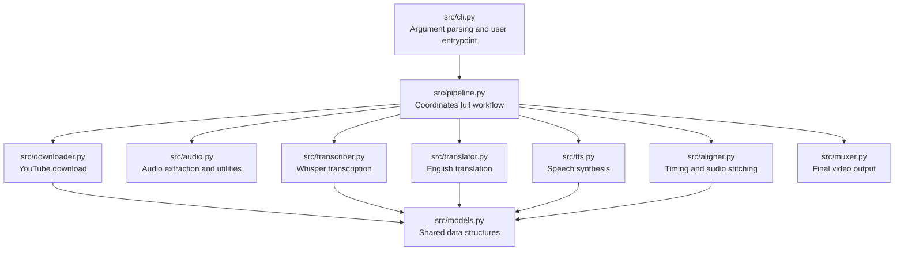
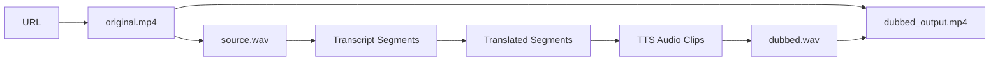

# Core Architecture

## High-Level Flow


## Pipeline Stages

### 1. Input

The user provides a YouTube URL through a command-line argument or a terminal prompt.

Example:

```bash
uv run autovid "https://www.youtube.com/watch?v=..."
```

### 2. Download Video

The downloader fetches the video using `yt-dlp`.

Output:

- Original video file.
- Metadata such as title, duration, and source URL.

### 3. Extract Audio

The audio processor extracts a clean audio track from the downloaded video using `ffmpeg`.

Output:

- A transcription-friendly `.wav` file, usually mono and 16 kHz.

### 4. Transcribe

The transcriber uses Whisper or Faster Whisper to convert speech into timestamped text segments.

Example segment:

```json
{
  "start": 12.4,
  "end": 18.9,
  "text": "Original spoken sentence"
}
```

### 5. Translate

Each transcript segment is translated into natural English.

The translation should prioritize meaning and flow rather than word-for-word literal translation.

Example:

```json
{
  "start": 12.4,
  "end": 18.9,
  "source_text": "Original spoken sentence",
  "english_text": "Natural English translation"
}
```

### 6. Synthesize Speech

The TTS module generates English audio for each translated segment.

The first version can use `edge-tts` because it is free, simple, and natural enough for a strong MVP.

### 7. Align Audio

The aligner places each generated English audio clip at the correct timestamp.

It should:

- Add silence before each segment.
- Preserve the original timing as much as possible.
- Optionally speed up or slow down TTS clips slightly if they are too long or too short.

### 8. Final Mux

The muxer combines:

- Original video stream.
- New dubbed English audio track.

Using `ffmpeg`, the video stream can be copied without re-encoding:

```bash
ffmpeg -i original.mp4 -i dubbed.wav -map 0:v -map 1:a -c:v copy -c:a aac output.mp4
```

## Module Architecture



## Data Flow



## Design Principle

Each stage should be independently testable. If translation fails, transcription output should still exist. If TTS fails for one segment, the logs should show exactly which segment failed. This makes the system easier to debug and easier to explain in the walkthrough.
