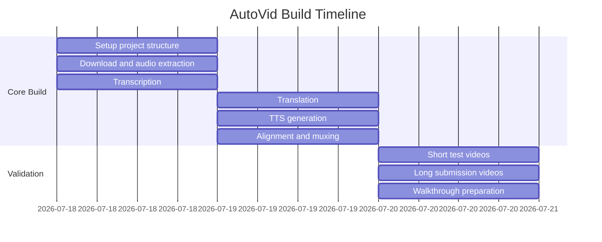

# Build Plan

## Deadline Context

Target completion date: before July 21, 2026.

The safest approach is to complete a working MVP first, then improve quality and optional features.

## Phase 1: Project Setup

Deliverables:

- Python package structure.
- CLI entrypoint.
- `requirements.txt`.
- Basic README.
- Output and working directories.

Expected result:

The project can run a placeholder pipeline from the terminal.

## Phase 2: Download and Audio Extraction

Deliverables:

- Download video from YouTube URL using `yt-dlp`.
- Save video to `outputs/<job_id>/source.mp4`.
- Extract audio to `outputs/<job_id>/source.wav`.
- Print progress logs.

Expected result:

A YouTube URL becomes a local video file and clean WAV audio file.

## Phase 3: Transcription

Deliverables:

- Run Faster Whisper on extracted audio.
- Save timestamped transcript as JSON.
- Save readable transcript as text.

Expected result:

The project produces segment-level transcript data with `start`, `end`, and `text`.

## Phase 4: Translation

Deliverables:

- Implement a translator interface.
- Add at least one working translation backend.
- Save translated segments as JSON.

Expected result:

Every transcript segment has an English version.

## Phase 5: TTS Generation

Deliverables:

- Generate one English audio clip per translated segment.
- Save clips under `outputs/<job_id>/tts_segments/`.
- Allow voice selection from the CLI.

Expected result:

The project can produce natural English speech for each translated segment.

## Phase 6: Alignment and Audio Stitching

Deliverables:

- Stitch TTS clips into one full dubbed audio track.
- Insert silence based on original timestamps.
- Export `dubbed.wav`.

Expected result:

Dubbed audio roughly matches the timing of the original video.

## Phase 7: Final Video Output

Deliverables:

- Replace original audio with dubbed English audio using `ffmpeg`.
- Save final output as `dubbed_output.mp4`.
- Print total processing time.

Expected result:

The project produces a playable English-dubbed video.

## Phase 8: Submission Runs

Deliverables:

- Run the script on one 30 minute video.
- Run the script on one 2 hour video.
- Record processing time for both.
- Check final videos manually.

Expected result:

Submission-ready output files and performance notes.

## Build Timeline



## MVP Definition

The MVP is complete when this works:

```bash
python -m autovid "https://www.youtube.com/watch?v=..."
```

And creates:

```text
outputs/<job_id>/
  source.mp4
  source.wav
  transcript.json
  translated_segments.json
  dubbed.wav
  dubbed_output.mp4
  run_summary.json
```

