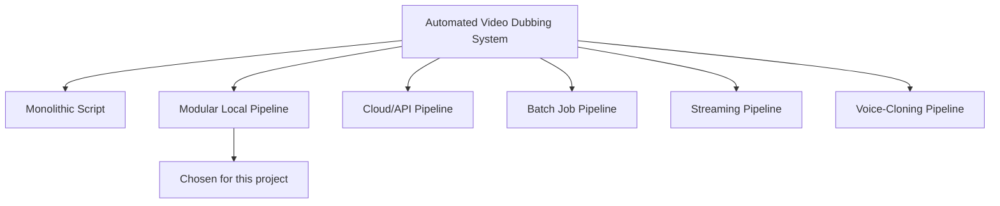
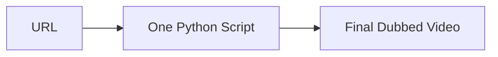
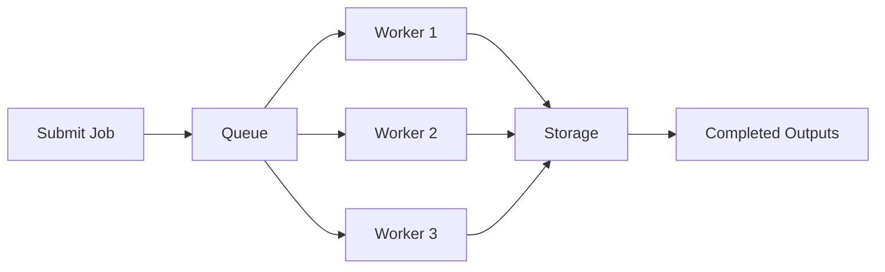
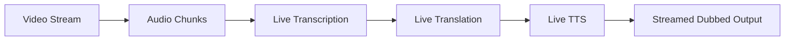
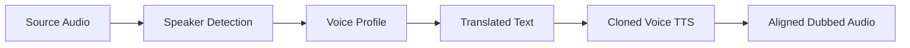
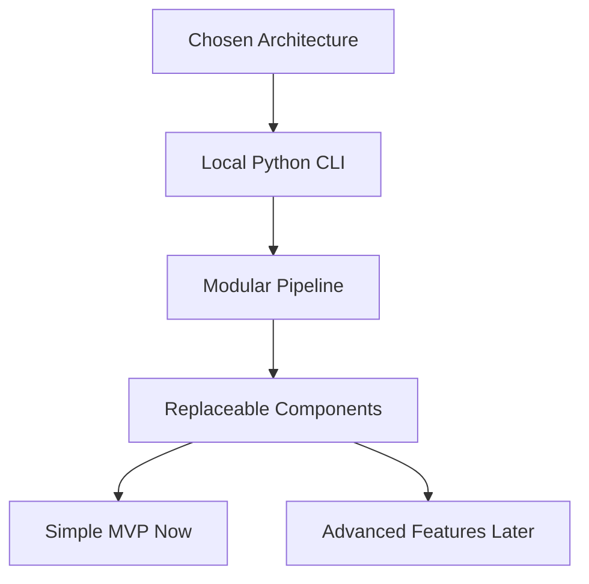

# Architecture Alternatives

This document compares different architectures that can be used for the automated video dubbing system and explains why this project uses a modular local pipeline.

## Architecture Options

## Option 1: Monolithic Script

In this architecture, all logic is written in one Python file.

Flow:

### Pros

- Fastest to write initially.
- Simple to run.
- Fewer files to manage.

### Cons

- Hard to debug when something fails.
- Difficult to test individual parts.
- Code becomes messy as features grow.
- Harder to explain as a serious engineering project.
- Reusing or replacing one component is painful.

### Why We Are Not Choosing It

This assignment is evaluated partly on code quality and clarity. A single large script may work, but it does not present the project as cleanly. It also becomes risky for long videos because debugging failures is harder.

## Option 2: Modular Local Pipeline

This is the architecture chosen for this project.

Each stage is separated into its own module:

- Download.
- Audio extraction.
- Transcription.
- Translation.
- TTS generation.
- Audio alignment.
- Final video muxing.

Flow:

### Pros

- Clean and easy to explain.
- Each stage can be tested separately.
- Failed stages can be retried without repeating the full pipeline.
- Easy to swap tools, such as replacing `edge-tts` with voice cloning later.
- Strong fit for the assignment's code quality criteria.
- Works locally without needing a full backend system.
- Good balance between speed, quality, and deadline safety.

### Cons

- More files than a monolithic script.
- Requires discipline to keep interfaces clean.
- Still runs mostly sequentially unless we add batching or parallel processing.
- Long videos may take time on a normal laptop.

### Why We Are Choosing It

This architecture gives the best balance for the internship assignment. It is practical enough to finish before the deadline, but structured enough to look like a serious engineering solution.

It also makes the walkthrough stronger because we can clearly explain each stage and its responsibility.

## Option 3: Cloud/API Pipeline

In this architecture, most heavy work is sent to cloud services.

Possible services:

- YouTube download locally or through a worker.
- Cloud speech-to-text API.
- Cloud translation API.
- Cloud TTS API.
- Cloud storage for video files.

Flow:

### Pros

- Can produce high-quality results.
- Easier to scale for many users.
- Faster if using powerful cloud hardware.
- Less local machine dependency.

### Cons

- Requires API keys and billing.
- More infrastructure complexity.
- Harder to submit as a simple Python assignment.
- Long videos can become expensive.
- Uploading/downloading large media files adds delay.
- Less impressive if most core work is delegated to APIs without clear engineering.

### Why We Are Not Choosing It For MVP

The assignment asks for a Python script. A cloud-heavy system may be overkill and introduces cost, setup, and reliability risks before the deadline.

However, our modular architecture can still support cloud translation or cloud TTS later through replaceable interfaces.

## Option 4: Batch Job Pipeline

This architecture is designed for processing many videos using a queue and workers.

Flow:

### Pros

- Good for processing many videos.
- Can retry failed jobs.
- Can run multiple workers.
- Better for production systems.

### Cons

- Needs queue infrastructure.
- More moving parts.
- Slower to build.
- Too complex for a single internship assignment.
- Does not improve the quality of one video by itself.

### Why We Are Not Choosing It For MVP

The assignment needs two final videos, not a production service for many users. A batch architecture is useful later, but it is not the fastest path to a high-quality submission.

## Option 5: Streaming Pipeline

This architecture processes the video while it is being downloaded or played.

Flow:

### Pros

- Lower wait time for live use cases.
- Useful for real-time translation.
- Advanced and impressive technically.

### Cons

- Very difficult timing problem.
- Translation quality can suffer without full context.
- TTS may lag behind original speech.
- More complex buffering and synchronization.
- Not required by the assignment.

### Why We Are Not Choosing It

The assignment requires saving a final dubbed video to disk. Offline processing gives better quality and simpler timing control than live streaming.

## Option 6: Voice-Cloning Pipeline

This architecture focuses on matching the original speaker's voice more closely.

Possible tools:

- Coqui XTTS.
- RVC.
- Speaker diarization with `pyannote.audio`.

Flow:

### Pros

- Better match to the assignment phrase "same voice, same energy."
- Can produce more impressive demos.
- Supports multi-speaker dubbing if done well.

### Cons

- Much harder to set up reliably.
- More GPU-heavy.
- More failure-prone before a tight deadline.
- Voice cloning quality varies a lot by source audio.
- May introduce ethical and consent concerns depending on source video.

### Why We Are Not Choosing It For MVP

Voice cloning is a stretch goal. The safest plan is to first build a reliable dubbing pipeline with natural TTS, then add voice cloning only if the core system is already working.

Our chosen modular architecture keeps the TTS stage separate, so adding voice cloning later does not require rewriting the full project.

## Chosen Architecture

We are choosing the modular local pipeline:

## Why This Is The Best Fit

| Criteria | Monolithic Script | Modular Local Pipeline | Cloud/API Pipeline | Batch Pipeline | Streaming Pipeline | Voice-Cloning Pipeline |
| --- | --- | --- | --- | --- | --- | --- |
| Fast to build | High | Medium | Medium | Low | Low | Low |
| Easy to debug | Low | High | Medium | Medium | Low | Low |
| Code clarity | Low | High | Medium | Medium | Medium | Medium |
| Output quality | Medium | High | High | High | Medium | Potentially very high |
| Deadline safety | Medium | High | Medium | Low | Low | Low |
| Cost control | High | High | Low | Medium | Medium | Medium |
| Future extensibility | Low | High | High | High | Medium | Medium |

## Main Tradeoff

The chosen architecture is not the most advanced possible architecture. It does not start with real-time streaming or perfect voice cloning.

Instead, it optimizes for:

- A working submission before the deadline.
- Clean code.
- Strong explanation.
- Reliable processing for 30 minute and 2 hour videos.
- Future upgrade paths.

That tradeoff is intentional and easy to defend in the walkthrough.

