# Code Explanation For Interview

This document explains the codebase file by file so you can confidently discuss the project in an interview or walkthrough.

## One-Line Project Explanation

AutoVid is a modular Python pipeline that takes a YouTube URL, downloads the video, extracts audio, transcribes speech, translates it into English, generates English TTS audio, aligns the dubbed audio to the original timestamps, and writes a final dubbed video.

## High-Level Code Flow

```mermaid
flowchart LR
    A["CLI input<br/>src/cli.py"] --> B["Config<br/>src/config.py"]
    B --> C["Pipeline<br/>src/pipeline.py"]
    C --> D["Download<br/>src/downloader.py"]
    D --> E["Audio extraction<br/>src/audio.py"]
    E --> F["Transcription<br/>src/transcriber.py"]
    F --> G["Translation<br/>src/translator.py"]
    G --> H["Energy analysis<br/>src/energy.py"]
    H --> I["TTS<br/>src/tts.py"]
    I --> L["Alignment<br/>src/aligner.py"]
    L --> J["Muxing<br/>src/muxer.py"]
    J --> K["Final video"]
```



## Project Files

### `pyproject.toml`

This is the `uv` project configuration.

What it does:

- Defines the project name, version, description, and Python version.
- Lists dependencies such as `yt-dlp`, `faster-whisper`, `edge-tts`, `pydub`, and `rich`.
- Creates the CLI command:

```toml
autovid = "cli:main"
```

Why this matters:

- The project can be run with `uv run autovid ...`.
- Dependencies are managed reproducibly through `uv`.
- The implementation uses a flat `src` layout, so modules live directly under `src/`.

Interview explanation:

"I used `uv` for dependency and environment management because it is fast and reproducible. The console script points to `cli:main`, which starts the pipeline."

### `uv.lock`

This is the dependency lockfile created by `uv`.

What it does:

- Records exact dependency versions.
- Helps the same environment be recreated later.

Interview explanation:

"The lockfile makes the project more reproducible, which is important for a media pipeline where dependency versions can affect behavior."

### `.gitignore`

This file prevents generated or local-only files from being committed.

Important ignored items:

- `.venv/`
- `outputs/`
- Python cache files
- test/type-checking caches

Interview explanation:

"Generated videos and virtual environments should not be committed, so I ignored them and kept the repository focused on source code and documentation."

## Source Code Files

### `src/cli.py`

This is the command-line entrypoint.

Main responsibilities:

- Defines command-line arguments with `argparse`.
- Supports options like `--translator`, `--voice`, `--whisper-model`, `--dry-run`, and `--stop-after`.
- Builds an `AppConfig`.
- Starts the `DubbingPipeline`.
- Handles errors cleanly.

Important idea:

The CLI does not do the actual dubbing work. It only parses user input and delegates to the pipeline.

Interview explanation:

"I kept the CLI thin. Its job is only to parse arguments, create configuration, and start the pipeline. This keeps business logic out of the command-line layer."

### `src/config.py`

This file owns runtime configuration.

Main responsibilities:

- Defines all allowed stop stages.
- Stores config in an immutable `AppConfig` dataclass.
- Reads values from CLI arguments or environment variables.
- Validates `--stop-after`.

Examples:

- `AUTOVID_TRANSLATOR`
- `AUTOVID_VOICE`
- `OLLAMA_MODEL`
- `GROQ_MODEL`

Why this matters:

The same code can run with different translators or voices without changing source files.

Interview explanation:

"Configuration is centralized in `AppConfig`, so the rest of the pipeline receives a clean typed object instead of reading environment variables everywhere."

### `src/pipeline.py`

This is the orchestrator of the full dubbing workflow.

Main responsibilities:

- Creates the output job folder.
- Runs each stage in order.
- Supports `--dry-run`.
- Supports `--stop-after` for incremental testing.
- Writes `run_summary.json`.

Stages:

1. Download
2. Audio extraction
3. Transcription
4. Translation
5. Text-to-speech
6. Audio alignment
7. Final video muxing

Important design choice:

The pipeline coordinates modules but does not contain the low-level logic for downloading, transcription, translation, or muxing.

Interview explanation:

"The pipeline is the coordinator. Each stage is isolated in its own module, which makes failures easier to debug and makes the architecture easier to extend."

### `src/models.py`

This file defines shared data structures.

Main dataclasses:

- `TranscriptSegment`
- `TranslatedSegment`
- `TTSClip`
- `RunPaths`

Why this matters:

Instead of passing loose dictionaries between stages, the code passes structured objects.

Example:

`TranscriptSegment` contains:

- segment index
- start time
- end time
- transcript text
- detected language

Interview explanation:

"I used dataclasses to make the data contracts between pipeline stages explicit. This improves readability and reduces mistakes when passing segment data around."

### `src/storage.py`

This file handles job folders and JSON serialization.

Main responsibilities:

- Creates a unique job ID.
- Creates a run output directory.
- Defines paths for all generated files.
- Writes and reads JSON.
- Converts dataclasses and `Path` objects into JSON-safe values.

Output structure:

```text
outputs/<job_id>/
  source.mp4
  source.wav
  metadata.json
  transcript.json
  translated_segments.json
  tts_segments/
  dubbed.wav
  dubbed_output.mp4
  run_summary.json
```

Interview explanation:

"I separated storage concerns so every stage writes predictable artifacts. This makes the pipeline resumable and easy to inspect during debugging."

### `src/logging_utils.py`

This file provides terminal logging.

Main responsibilities:

- Wraps `rich` console output when available.
- Falls back to normal `print`.
- Provides simple log methods: `info`, `success`, `warning`, `error`, and `stage`.

Why this matters:

The assignment explicitly asks to print progress while processing.

Interview explanation:

"I added a small logger wrapper so progress messages are consistent across all modules and still work even if `rich` is unavailable."

### `src/process.py`

This file contains shared subprocess utilities.

Main responsibilities:

- Checks whether a required binary exists.
- Runs shell commands safely through `subprocess.run`.
- Raises readable errors when commands fail.

Used by:

- `audio.py`
- `muxer.py`

Interview explanation:

"I wrapped subprocess calls so `ffmpeg` errors are handled in one place instead of duplicating command-running logic in every module."

### `src/downloader.py`

This file downloads the source YouTube video.

Main responsibilities:

- Uses `yt-dlp`.
- Downloads the best MP4-compatible format.
- Saves the video as `source.mp4`.
- Saves metadata such as title, duration, uploader, and source URL.

Why `yt-dlp`:

- More reliable than many direct YouTube download libraries.
- Commonly used for video-processing pipelines.

Interview explanation:

"The downloader stage uses `yt-dlp` because it handles YouTube formats reliably. I also save metadata so the final run summary can include duration and source details."

### `src/audio.py`

This file extracts clean audio from the source video.

Main responsibilities:

- Requires `ffmpeg`.
- Converts video audio into a mono 16 kHz WAV file.
- Saves it as `source.wav`.

Why mono 16 kHz WAV:

- It is a good format for speech transcription.
- Whisper-style models work well with clean PCM audio.

Interview explanation:

"Before transcription, I normalize the audio into mono 16 kHz WAV because it gives the speech model a predictable input format."

### `src/transcriber.py`

This file performs speech-to-text transcription.

Main responsibilities:

- Uses `faster-whisper`.
- Loads the selected Whisper model.
- Runs transcription with VAD filtering.
- Produces timestamped transcript segments.
- Saves both JSON and readable text transcript.

Why timestamps matter:

The timestamps are reused later to place English TTS audio back at the correct time in the video.

Interview explanation:

"I used Faster Whisper because it gives segment-level timestamps. Those timestamps are the backbone of the dubbing alignment stage."

### `src/translator.py`

This file handles translation into English.

Main responsibilities:

- Defines a `Translator` protocol.
- Provides `PassthroughTranslator`.
- Provides `OllamaTranslator`.
- Provides `GroqTranslator`.
- Builds prompts for natural English dubbing.
- Parses model JSON responses robustly.

Translator backends:

- `passthrough`: useful for testing English videos.
- `groq`: default cloud/free-tier backend if API key is available.
- `ollama`: optional local/free translation backend.

Why this architecture:

The pipeline does not care which translation provider is used. All providers return the same `TranslatedSegment` objects.

Interview explanation:

"Translation is provider-agnostic. I can run locally with Ollama for zero-cost translation, or switch to Groq for faster cloud inference without changing the pipeline."

Important prompt design:

- Preserve meaning.
- Use natural spoken English.
- Keep translations concise for timing.
- Return JSON only.

This makes the output easier to parse and easier to align later.

### `src/tts.py`

This file generates English speech.

Main responsibilities:

- Uses `edge-tts`.
- Generates one MP3 file per translated segment.
- Saves all files under `tts_segments/`.
- Writes a `tts_manifest.json`.

Why one file per segment:

- It preserves the connection between translation and original timing.
- It makes failures easy to identify.
- It allows each clip to be placed at the correct timestamp later.

Interview explanation:

"Instead of generating one large TTS file, I generate speech per segment. That gives me better timing control and makes debugging easier."

### `src/energy.py`

This file estimates the original speaker's delivery energy.

Main responsibilities:

- Reads `source.wav`.
- Measures loudness for each timestamped segment.
- Estimates speaking pace from source text length and segment duration.
- Maps those signals into TTS `rate`, `pitch`, and `volume`.
- Saves `energy_profiles.json`.

Why this matters:

The assignment asks for the same energy as the original. This is not full emotion cloning, but it makes the dub less flat by carrying over delivery cues from the source audio.

Interview explanation:

"I added an expressive TTS layer that analyzes original segment loudness and speaking speed, then maps that into edge-tts rate, pitch, and volume. It helps preserve energy without requiring heavy voice-cloning models."

### `src/aligner.py`

This file creates the final dubbed audio track.

Main responsibilities:

- Uses `pydub`.
- Creates a silent timeline.
- Places each TTS clip at the original segment start time.
- Mildly speeds up clips that are too long.
- Exports `dubbed.wav`.

Why this matters:

Dubbing quality depends heavily on timing. The aligner preserves the original rhythm by using Whisper timestamps.

Interview explanation:

"The aligner builds a full audio timeline from individual TTS clips. Each clip is overlaid at the original timestamp, which keeps the dub synchronized with the video."

### `src/muxer.py`

This file creates the final dubbed video.

Main responsibilities:

- Uses `ffmpeg`.
- Takes the original video stream.
- Takes the generated dubbed audio.
- Writes `dubbed_output.mp4`.
- Copies the video stream without re-encoding.

Why copy video:

- Faster processing.
- Keeps visual quality unchanged.

Interview explanation:

"The muxing stage replaces only the audio track. The video stream is copied, so the visuals remain unchanged and the final export is faster."

### `src/__main__.py`

This file allows module-style execution.

Main responsibility:

- Imports and calls `main()` from `cli.py`.

Interview explanation:

"This is a small convenience entrypoint. The main supported command is still `uv run autovid`, but this keeps the code easy to run during development."

## Why The Architecture Is Scalable

The current project is a local CLI, but the modules are separated in a way that can grow.

Examples:

- Replace `OllamaTranslator` with another translation provider.
- Replace `EdgeTTSGenerator` with a voice-cloning backend.
- Add speaker diarization before TTS.
- Add a job queue around `DubbingPipeline`.
- Add a web API that calls the same pipeline.
- Cache stages using the output files already written to disk.

Interview explanation:

"The architecture is designed as a staged pipeline. That makes the MVP simple, but the same structure can grow into a production batch-processing service."

## Key Design Decisions To Mention

### 1. Modular Pipeline

Each stage has one responsibility.

Benefit:

- Easier debugging.
- Easier testing.
- Easier future upgrades.

### 2. Timestamp-Based Dubbing

Whisper timestamps are reused for TTS placement.

Benefit:

- Better synchronization with the original video.

### 3. Pluggable Translation

Translation is not locked to one provider.

Benefit:

- Ollama can be used locally.
- Groq can be used for faster cloud translation.
- OpenAI or other APIs can be added later.

### 4. Intermediate Artifacts

Every stage writes outputs to disk.

Benefit:

- If translation fails, the transcript still exists.
- If TTS fails, translated segments still exist.
- Debugging long videos is easier.

### 5. `uv` For Reproducibility

Dependencies are managed with `uv`.

Benefit:

- Fast setup.
- Locked dependencies.
- Cleaner project execution.

## Common Interview Questions

### Why did you not use only one script?

"A single script would be faster initially, but harder to debug and extend. Since the assignment also evaluates code quality, I chose a modular pipeline where each file owns one stage."

### Does the project require OpenAI?

"No. The MVP does not require OpenAI. It can use Ollama locally for translation, Faster Whisper for transcription, and edge-tts for speech generation. Groq is optional if I want faster cloud translation."

### Why use Ollama?

"Ollama gives a free local translation backend. It keeps cost low and makes the project less dependent on paid APIs."

### Which Ollama model would you use?

"I would start with `qwen2.5:7b` because it is a good balance of multilingual ability, English rewriting, and local performance. If needed, I would also test `llama3.1:8b`."

### Why use Faster Whisper?

"Faster Whisper gives reliable multilingual transcription with timestamps, and those timestamps are essential for aligning the dubbed audio."

### Why use edge-tts?

"It is free, easy to integrate, and produces natural neural voices. It is not true voice cloning, but it is a strong MVP choice before adding heavier models."

### How would you improve the project later?

"I would add speaker diarization, voice cloning, better duration-aware translation, parallel TTS generation, stage caching, and a queue-based worker architecture for long videos."

## Short Architecture Script

```text
The project is built as a modular Python pipeline. The CLI collects the YouTube URL and runtime options, then the pipeline creates a job folder and runs each stage. First it downloads the video with yt-dlp, then extracts clean WAV audio with ffmpeg. Faster Whisper transcribes the audio into timestamped segments. Those segments are translated into natural English using a pluggable translator, usually Ollama for local free translation. Then edge-tts generates one audio clip per translated segment. The aligner places each clip back at the original timestamp, and finally ffmpeg replaces the original audio with the dubbed track while copying the video stream unchanged.
```
