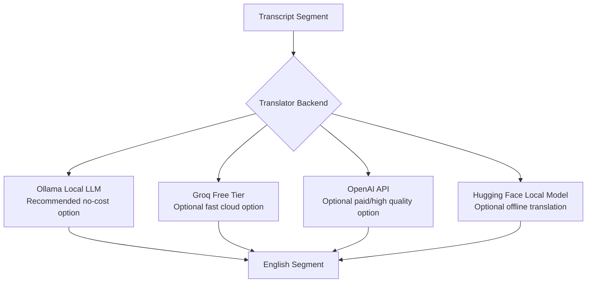

# LLM and Translation Strategy

## Does This Project Require An LLM?

Strictly speaking, the project does not require a general-purpose LLM like OpenAI or Groq.

The required AI tasks are:

- Speech-to-text transcription.
- Translation into English.
- Text-to-speech generation.

These can be handled by specialized models and tools:

- Whisper or Faster Whisper for transcription.
- IndicTrans2, NLLB, MarianMT, Ollama, or an API for translation.
- `edge-tts` for speech synthesis.

## Where An LLM Helps

An LLM helps most in the translation stage because the assignment wants meaning-preserving, natural English, not literal translation.

For example, a literal translation may be technically correct but awkward. An LLM can rewrite it into natural spoken English.

## Recommended Choice For This Project

Use a pluggable translator interface with this priority:



## Best Practical Setup

### Primary Recommendation: Ollama

Use Ollama if your laptop can run it.

Pros:

- Free.
- Local.
- No API key.
- Good for explaining privacy and cost control.
- Simple integration through HTTP.

Cons:

- Translation quality depends on the model.
- Slower than hosted APIs on CPU.
- Long videos may take significant time.

Good Ollama model options:

```text
llama3.1:8b
qwen2.5:7b
gemma2:9b
```

For translation, `qwen2.5:7b` is a strong local option if available.

### Optional Cloud Recommendation: Groq Free Tier

Groq can be useful if you have a free API key and want fast translation.

Pros:

- Very fast.
- Often has a free tier.
- Good enough for natural English rewrites.

Cons:

- Requires internet and API key.
- Free tier limits may change.
- Long videos may hit rate limits.

### Optional Higher Quality: OpenAI API

OpenAI can produce high-quality translations and rewrites.

Pros:

- Strong translation and natural phrasing.
- Good instruction following.

Cons:

- Usually paid.
- Requires API key.
- Not necessary for MVP if Ollama or Groq works.

## Translator Interface

The code should not lock us to one provider.

Recommended design:

```python
class Translator:
    def translate_segments(self, segments: list[TranscriptSegment]) -> list[TranslatedSegment]:
        raise NotImplementedError
```

Backends:

```text
OllamaTranslator
GroqTranslator
OpenAITranslator
PassthroughTranslator
```

`PassthroughTranslator` is useful for testing with English videos because it returns the original text unchanged.

## Recommended Environment Variables

```text
AUTOVID_TRANSLATOR=groq
OLLAMA_MODEL=qwen2.5:7b
GROQ_API_KEY=...
OPENAI_API_KEY=...
```

## Translation Prompt Template

Use this prompt for each batch of transcript segments:

```text
You are translating video speech into natural spoken English for dubbing.

Rules:
- Preserve the meaning.
- Use natural conversational English.
- Keep each translation concise so it can fit the original timing.
- Do not add explanations.
- Return valid JSON only.

Input segments:
[
  {"index": 0, "start": 1.2, "end": 4.8, "text": "..."}
]

Return:
[
  {"index": 0, "english_text": "..."}
]
```

## Final Recommendation

Implement Ollama first because it is free and local. Keep Groq and OpenAI as optional backends. This gives you a strong story:

"The system is provider-agnostic. I used a local/free translation backend for cost control, but the architecture can switch to hosted LLMs for higher throughput or quality."
