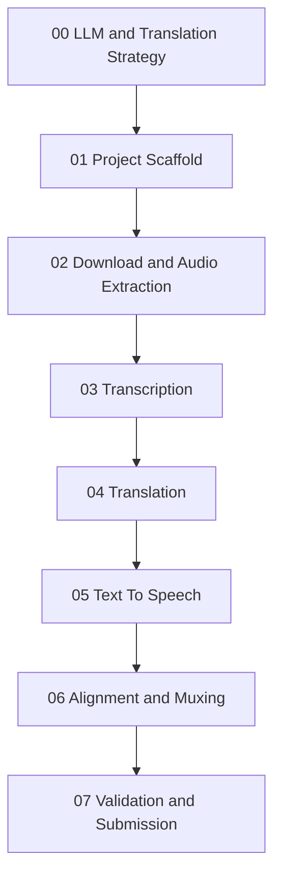

# Build Playbook

This folder contains the phase-wise build plan for AutoVid. Each phase includes:

- Goal.
- What to implement.
- Expected files.
- Acceptance checks.
- A Codex prompt for that phase.

## Recommended Build Order



## MVP Target

The MVP should run like this:

```bash
python -m autovid "https://www.youtube.com/watch?v=..."
```

And produce:

```text
outputs/<job_id>/
  source.mp4
  source.wav
  transcript.json
  transcript.txt
  translated_segments.json
  tts_segments/
  dubbed.wav
  dubbed_output.mp4
  run_summary.json
```

## Recommended Strategy

Build the system with replaceable backends:

- Transcription backend: Faster Whisper.
- Translation backend: Ollama first, API optional, local Hugging Face fallback later.
- TTS backend: `edge-tts` first.
- Video/audio backend: `ffmpeg`.

This keeps the project practical before the deadline while still sounding strong architecturally.

